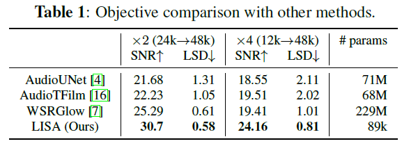
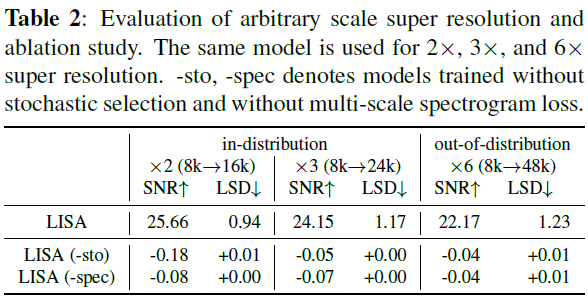

# LISA (Local Implicit representation for Super resolution of Arbitrary scale)

This repository contains the official implementation for LISA introduced in the following paper:

Learning Continuous Representation of Audio for Arbitrary Scale Super Resolution.

The paper can be found at https://arxiv.org/abs/2111.00195.




### Environment
- Python 3
- Pytorch 1.6.0
- TensorboardX
- yaml, numpy, tqdm, imageio

If you find out any other dependency is required, please let us know via github issue or pull requests.

### Reproducing Experiments


- Read `scripts/setup.sh` and `configs/audio/lisa.yaml` carefully for model and experiments setup.

- Prepare datasets to use (such as VCTK).

**To train model**: run `scripts/train_audio.sh` 


### How to cite

If you find our work useful in your research, please cite:

```
@inproceedings{kim2021lisa,
  title={Learning Continuous Representation of Audio for Arbitrary Scale Super Resolution},
  author={Jaechang Kim and Yunjoo Lee and Seunghoon Hong and Jungseul Ok},
  booktitle={ICASSP},
  year={2022}
}
```

### Reference

This repository is based on previous works below.
* https://github.com/yinboc/liif 
* https://github.com/lucidrains/siren-pytorch
